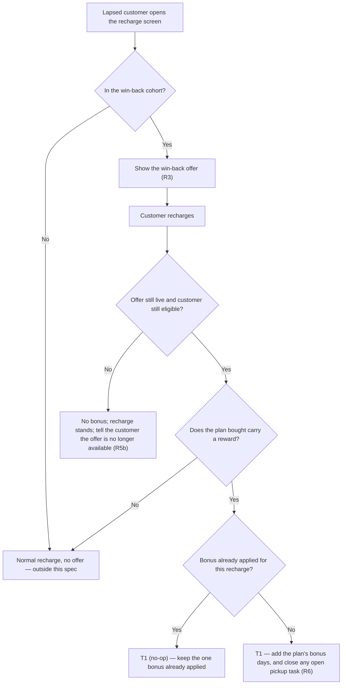

# Renewal Win-Back Offer — bonus days for a lapsed customer who still has the router

> Offer Engine renewal use case, V1. A customer whose plan ran out 30–60 days ago, whose router has not been collected, sees a bonus-days offer when they open the app to recharge. They recharge; the bonus days are added. Built on the existing offer engine — no new system.

| | | | |
|---|---|---|---|
| **Owner** — Ashish Raj | **Reviewer** — [Eng lead] ⚠️ *AI GENERATED — review* | **Status** — Draft | **Sign-off** — Pending |
| **Version** — v0.1 · 14 Sep 2026 | **Consulted — Offer Engine** — [name] ⚠️ *AI GENERATED — review* | **Consulted — Router Recovery / Ops** — [name] ⚠️ *AI GENERATED — review* | **Consulted — Growth** — [name] ⚠️ *AI GENERATED — review* |

---

## 1. Objective & Definition of Success

**Objective.** A customer who stopped recharging a month ago, and still has our router in their home, opens the app and finds a reason to come back — bonus days on whatever plan they buy.

**Boundary.** This spec governs customers **between R30 and R60** (C-01, C-02) whose router has not been collected. It leaves unchanged: the Welcome Offer and every acquisition path; the router-recovery flow itself, which keeps running as it does today (R6 is the one touch-point); customers at R0–R29 or past R60; and the normal recharge path when no offer applies (AC-REG-1). The reward map is **offer data, not spec** — set per offer in the engine (R4). Out of scope: proving lift with a holdout (see Overrides), any service-issue or compensation use case, and price-setting.

### Guardrails — promises that hold on every path

| ID | Guardrail | One line | Anchors |
|---|---|---|---|
| G1 | **Days, never price** | The reward is always bonus plan-days — never a discount on the plan or a refund. | R4 · AC-GRD-1 · MQ-5 |
| G2 | **Only the eligible see it** | Nobody outside the cohort — wrong window, or router already collected — ever sees or gets this offer. | R2 · R5 · AC-VIS-2 · AC-GRD-2 · MQ-3 |
| G3 | **Applied exactly once** | One customer gets the bonus once per recharge, whatever retries or duplicate confirmations occur. | R4 · T1 · AC-DUP-1 · MQ-2 |
| G4 | **No partner visits a customer who came back** | Once a customer recharges, no field partner is sent to collect their router. | R6 · AC-PICKUP-1 · MQ-4 |

### Success metrics

| ID | Metric | Baseline | Target | Source |
|---|---|---|---|---|
| M1 | Share of eligible customers who recharge during R30–R60 | **19.8%** — measured 14 Sep 2026 over 29,106 customers who reached R30 without recharging | **30%** | MQ-1 |

**Invariant (not a metric):** G2 views by anyone outside the cohort = 0, zero tolerance. Monitored via MQ-3, not trended.
**Invariant (not a metric):** G4 partner visits to a customer who has recharged = 0, zero tolerance. Monitored via MQ-4, not trended.

**Reading M1 honestly.** There is no holdout (Overrides), so the live number is compared against the 19.8% historical baseline. A general upswing in recharges would move it too. M1 is an adoption measure, not a proof of lift.

---

## 2. User Stories & Rules

| ID | Story | MUST | MUST NOT |
|---|---|---|---|
| R1 | As a member of the growth team, I define a win-back offer in the existing offer panel, so I do not need a new tool. | Let the definer set the offer window, the reward per plan (R4), and attach the win-back cohort as the offer's audience. | Require a new admin surface, or a reward expressed as a price (G1). |
| R2 | As a member of the growth team, I target the offer at lapsed customers who still have our router, so I spend only where a win-back is possible. | **(a)** Include a customer whose latest plan expired between C-01 and C-02 days ago with no recharge since. **(b)** Exclude any customer whose router has been collected. **(c)** Refresh the cohort every C-03. | Include anyone outside that window, or anyone whose router is already back (G2). |
| R3 | As a lapsed customer, I see the offer when I open the app to recharge, so I know coming back is worth it. | **(a)** Show the offer on the recharge screen to a customer in the cohort. **(b)** Show at most one win-back offer at a time (C-04). **(c)** State the bonus days for each plan, so the customer sees what each choice earns. | Show it to anyone outside the cohort (G2); show more than one at once. |
| R4 | As a lapsed customer, I get the bonus days on the plan I buy, so the offer is real. | **(a)** Add the bonus days set for that plan in the offer's reward map. Launch values: 2+2, 7+7, 14+14. **(b)** Apply them on the recharge confirming, with no action from the customer. **(c)** Grant nothing when the plan bought carries no reward in the offer. | Require the customer to claim, redeem or contact support; apply a reward for a plan the offer does not cover. |
| R5 | As a lapsed customer who acts too late, I get a plain recharge and am told why, so I never need to call support. | **(a)** Stop showing the offer once the customer passes C-02 or their router is collected. **(b)** If they recharge after the offer that matched them is gone, let the recharge stand with no bonus and tell them the offer is no longer available. | Leave a customer who saw the offer with a silent plain recharge and no explanation. |
| R6 | As an operations lead, I want a returning customer taken off the pickup list immediately, so no partner knocks on a paying customer's door. | Close any open router-pickup task for that customer as *customer recharged* when the recharge confirms (C-05). ⚠️ *AI GENERATED — review* | Send, or leave assigned, a pickup task for a customer who has recharged (G4). |

---

## 3. System Behaviour

### 3a. System flow chart

**Precedence — leaving the cohort:** eligibility is checked again when the recharge confirms, not only when the offer was shown. A customer who passed C-02 or whose router was collected between seeing the offer and paying gets no bonus; the recharge stands and they are told why (AC-RACE-1).

**Precedence — cohort staleness:** the cohort is a list refreshed every C-03, so a customer can be on it and no longer qualify. The recharge-time check above is what resolves that, and it wins (AC-RACE-1).

### 3b. State transition table — canon

| ID | From | Action / Trigger | Rule / Check | To | Side-effects |
|---|---|---|---|---|---|
| T1 | — | Recharge confirmed while a win-back offer is live | Customer in cohort at this instant (R2), offer live, plan bought carries a reward, no bonus already applied for this recharge | Applied | The plan's bonus days are added once (R4, G3); any open router-pickup task for the customer closes as *customer recharged* (R6, G4). |
| T2 | Applied | Bonus not applied within C-06 of a valid recharge | — | Applied *(recovered)* or escalated | Customer-visible outcome only: by C-06 the bonus is applied, or the case is escalated to Support/Ops with the customer notified. The paid plan is untouched — it was a real recharge. Recovery inside the window is the implementer's. |

---

## 4. Screen Requirements

**Master design file:** none exists (see Overrides). The Welcome Offer's own design is recorded only as Figma node `15473-22826`, frame "Naveen offer"; this feature has nothing yet.

### Recharge screen — customer app — [design link needed]

**States:** offer shown (in cohort) · no offer (not in cohort — screen unchanged) · no longer available (recharged after leaving the cohort)
**Freshness:** reflects the cohort as of the last refresh (C-03); eligibility is re-checked at recharge

| Element | Source / Routes to | Logic |
|---|---|---|
| Field — offer card | live win-back offer for this customer | shown only to a customer in the cohort (R3a); never to anyone else (G2) |
| Field — per-plan bonus | offer reward map | each participating plan shows its bonus days and the resulting total, e.g. 14 + 14 = 28 days (R3c, R4a) |
| Field — no-longer-available notice | recharge after leaving the cohort | shown when the recharge stands with no bonus, with the reason (R5b) |
| Field — total plan days | purchased plan + bonus | shown as days, never rupees (G1) |

### Offer setup — growth admin — existing offer panel

**States:** editing (draft) · publish-blocked (a publish check failed) · live (inside window) · ended (past end)
**Freshness:** a newly live offer reaches eligible customers at the next cohort refresh (C-03)

| Element | Source / Routes to | Logic |
|---|---|---|
| Field — offer type | growth input | set to the renewal type (R1) |
| Field — audience | win-back cohort | the cohort list replaces polygon targeting for this offer type (R2) ⚠️ *AI GENERATED — review* |
| Field — reward per plan | growth input · rate-card plans | whole bonus days per plan_id; a price value is rejected (R4a, G1) |
| Field — start / end time | growth input | both required; end after start (R1) |

---

## 5. Configurability

| ID | Parameter | Default | Range | Who changes it |
|---|---|---|---|---|
| C-01 | Cohort window start — days since plan expiry | 30 | 15–45 ⚠️ *AI GENERATED — review* | PM |
| C-02 | Cohort window end — days since plan expiry | 60 | 45–120 ⚠️ *AI GENERATED — review* | PM |
| C-03 | Cohort refresh cadence | Daily | Daily only in V1 ⚠️ *AI GENERATED — review* | Engineering |
| C-04 | Max live win-back offers visible to one customer | 1 | Fixed in V1 ⚠️ *AI GENERATED — review* | Product |
| C-05 | Pickup-task close window after recharge confirms | 5 min | 1–30 min ⚠️ *AI GENERATED — review* | PM + Ops |
| C-06 | Bonus-application recovery window — the outer deadline by which the system must apply the bonus or escalate | 10 min | 5–30 min ⚠️ *AI GENERATED — review* | PM + Eng |

---

## 6. Measurement

| ID | The system must be able to answer… | Feeds |
|---|---|---|
| MQ-1 | Of the customers eligible in a period, what share recharged during R30–R60? | M1 |
| MQ-2 | For each recharge that earned a bonus, was it applied exactly once, and within C-06? | G3 invariant · T1 · T2 |
| MQ-3 | Was this offer ever shown to, or applied for, anyone outside the cohort? | G2 invariant |
| MQ-4 | Did any partner visit, or stay assigned to, a customer who had already recharged? | G4 invariant |
| MQ-5 | Was any win-back reward ever expressed or applied as a price rather than days? | G1 |

---

## 7. Acceptance Criteria

### SET — Offer setup (R1, R2, R4)

| AC | Given / When / Then | Verifies | Status |
|---|---|---|---|
| AC-SET-1 | **Given** a growth member creating a win-back offer, **When** they set the reward map to 2+2, 7+7 and 14+14 with a start and end time, **Then** the offer saves with that map and window, and the reward field accepts only whole bonus days — a price value blocks publish. | R1 · R4a · G1 | Settled |
| AC-SET-2 | **Given** the cohort refresh has run, **When** it is inspected, **Then** it contains every customer whose latest plan expired between 30 and 60 days ago (C-01, C-02) with no recharge since, and none whose router has been collected. | R2 | Settled |

### VIS — Visibility (R3, G2)

| AC | Given / When / Then | Verifies | Status |
|---|---|---|---|
| AC-VIS-1 | **Given** a customer whose plan expired 40 days ago and whose router is still with them, **When** they open the recharge screen, **Then** one win-back offer card is shown, listing the bonus days for each participating plan. | R3a · R3b · R3c | Settled |
| AC-VIS-2 | **Given** three customers — one at R20, one at R75, and one at R40 whose router was collected last week — **When** each opens the recharge screen, **Then** none of them sees a win-back offer. | R2 · R3a · G2 | Settled |

### APP — Bonus applied (T1, R4)

| AC | Given / When / Then | Verifies | Status |
|---|---|---|---|
| AC-APP-1 | **Given** an eligible customer shown a 14+14 offer, **When** they recharge on the 14-day plan, **Then** within C-06 they have 28 total days, shown as days with no rupee figure, and no action was required of them. | R4a · R4b · T1 · G1 | Settled |
| AC-APP-2 | **Given** the same offer covering only the 2-, 7- and 14-day plans, **When** an eligible customer recharges on a 30-day plan, **Then** no bonus is added and the recharge stands as a normal 30-day recharge. | R4c | Settled |
### DUP — Duplicate trigger (T1, G3)

| AC | Given / When / Then | Verifies | Status |
|---|---|---|---|
| AC-DUP-1 | **Given** an eligible customer availing a 14+14 offer, **When** their recharge confirmation fires twice, **Then** the bonus is added exactly once — 28 total days, never 42. | G3 · T1 | Settled |

### PICKUP — Router recovery (R6, G4)

| AC | Given / When / Then | Verifies | Status |
|---|---|---|---|
| AC-PICKUP-1 | **Given** an eligible customer at R40 with an open router-pickup task assigned to a partner, **When** they recharge, **Then** within C-05 the task is closed as *customer recharged* and no partner visit follows. | R6 · G4 | Settled |
| AC-PICKUP-2 | **Given** an eligible customer with no pickup task at all, **When** they recharge, **Then** the bonus applies normally and nothing is created or closed. | R6 | Settled |

### FAIL — Failure window (T2)

| AC | Given / When / Then | Verifies | Status |
|---|---|---|---|
| AC-FAIL-1 | **Given** a valid recharge whose bonus has not appeared, **When** C-06 is reached, **Then** the bonus is either applied or the case is escalated to Support/Ops with the customer notified, and the paid plan is unaffected. | T2 · C-06 | Settled |

### RACE — Leaving the cohort (§3a precedence)

| AC | Given / When / Then | Verifies | Status |
|---|---|---|---|
| AC-RACE-1 | **Given** a customer who saw the offer yesterday at R60, **When** they recharge today at R61 — or after their router was collected this morning — **Then** no bonus is added, the recharge stands, and the app tells them the offer is no longer available. | R5a · R5b · §3a precedence | Settled |

### WF — Workflow (T1)

| AC | Given / When / Then | Verifies | Status |
|---|---|---|---|
| AC-WF-1 | **Given** a customer at R40 whose router is still with them and an open pickup task, **When** they open the app, see the win-back offer, and recharge on the 14-day plan, **Then** they end with 28 days shown as days, the pickup task closes as *customer recharged*, no partner visits, and no support contact or manual step was needed anywhere in the journey. | T1 · R3 · R4 · R6 · G1 · G4 | Settled |

### BV — Boundary values (C-01, C-02 edges)

| AC | Given / When / Then | Verifies | Status |
|---|---|---|---|
| AC-BV-1 | **Given** the cohort window C-01 [30] to C-02 [60], **When** the recharge screen is opened by a customer at R29, one at R30, one at R60 and one at R61, **Then** the R30 and R60 customers see the offer and the R29 and R61 customers do not. | R2a · C-01 · C-02 | Settled |

### CFG — Configurability (C-02)

| AC | Given / When / Then | Verifies | Status |
|---|---|---|---|
| AC-CFG-1 | **Given** C-02 changed from 60 to 90, **When** the next cohort refresh runs (C-03), **Then** customers between R61 and R90 enter the cohort and see the offer, and customers past R90 do not. | C-02 · C-03 · R2 | Settled |

### REG — Regression (§1 Boundary)

| AC | Given / When / Then | Verifies | Status |
|---|---|---|---|
| AC-REG-1 | **Given** a customer with no matching win-back offer, **When** they recharge, **Then** the normal recharge path runs with no bonus and no new screen. | Boundary | Settled |
| AC-REG-2 | **Given** a new lead in the acquisition flow, **When** a win-back offer is live in their area, **Then** their Welcome Offer experience is unchanged and they never see a win-back offer. | Boundary · G2 | Settled |

### GRD — Guardrails

| AC | Given / When / Then | Verifies | Status |
|---|---|---|---|
| AC-GRD-1 | **Given** any win-back offer on any path, **When** its reward is inspected end to end, **Then** it is always bonus plan-days, never a price, discount or refund. | G1 | Settled |
| AC-GRD-2 | **Given** any live win-back offer, **When** every surface is checked against a customer outside the cohort, **Then** the offer was never shown or applied to them. | G2 | Settled |

---

## 8. Glossary

| Term | Meaning | Owner (domain) |
|---|---|---|
| R-day | Days since a customer's latest plan expired with no recharge since. R30 = thirty days past expiry. | Customer lifecycle |
| Win-back cohort | **Canonical definition:** customers between C-01 and C-02 R-days whose router has not been collected. Refreshed every C-03. All other mentions cite this. | Growth |
| Router not collected | No completed router-pickup for this customer. A pickup task may be open — that does not disqualify them; it is closed on recharge (R6). ⚠️ *AI GENERATED — review* | Router Recovery / Ops |
| Bonus days | Extra plan-days granted for the plan bought, set per plan_id by the offer's reward map. | Growth |
| Reward map | The offer's plan_id → bonus-days table, set in the offer panel. Launch values 2+2, 7+7, 14+14. Offer data, not spec. | Growth |

---

## 9. Notes for System Capabilities

The existing offer engine supplies most of this. These are the gaps, verified against the deployed branch on 14 Sep 2026 (`customer-offer-service` @ `offer-enhancement`).

| Capability | Needed by | State today |
|---|---|---|
| **Renewal offers must respect their audience.** A renewal-type offer currently skips the audience check entirely and matches every customer with a location on file. | R2 · G2 · MQ-3 | **Blocker.** Must be fixed before any renewal offer is published, including a test one. |
| Target an offer at a supplied list of customers rather than an area. | R2 · G2 | Not supported — audience is one area, and only one. |
| Ask for, and show, a live offer on the recharge screen. | R3 | Not supported — the offer lookup is wired only into the new-customer payment screen. |
| Tell the offer engine a recharge has confirmed, so the bonus is granted. | R4b · T1 | An entry point exists and matches the estate's event convention, but nothing sends to it today. |
| Apply the bonus or escalate within C-06. | T2 · AC-FAIL-1 | The recovery job exists but is switched off. Must be enabled. |
| Close an open router-pickup task as *customer recharged* on recharge. | R6 · G4 | *Customer recharged* is already a recorded pickup outcome; the automatic close on recharge needs confirming with Ops. ⚠️ *AI GENERATED — review* |
| Record every offer shown, applied and suppressed, so measurement can read it. | MQ-1..4 | Already present — the engine logs one line per decision, with a reason on every suppression. |
| Stop showing the offer and refuse the bonus once a customer leaves the cohort. | R5 · AC-RACE-1 | Window and live checks exist; the cohort re-check at recharge is new. |

---

## Overrides

| Rule overridden | What was done instead | Rationale | Approved by |
|---|---|---|---|
| §1 — a success metric should support a causal read | M1 is measured against a historical baseline with **no holdout** | PM chose to ship uncontrolled and add a holdout later. Accepted with the consequence recorded in §1 "Reading M1 honestly": ~20% of this cohort returns unaided, so the majority of grants will go to customers who were coming back anyway, and that share cannot be measured under this design. | Ashish Raj (PM) |
| §4 — every screen block has a design link | No design file exists for this feature | Design not yet started; the Welcome Offer precedent has no file either. | Ashish Raj (PM) |
| §2 R4a — every number outside §5 is a C-id | The launch reward values 2+2, 7+7 and 14+14 are named in R4a | PM's instruction: the reward map belongs to the offer engine, not the spec. The values are recorded as launch data so engineering has something concrete to build against; changing them is an offer edit, not a spec change. | Ashish Raj (PM) |

---

## AI-generated content for review

| Location | What was generated | Basis |
|---|---|---|
| Header | Reviewer and all three consulted names | Not supplied. |
| §2 R6 · §3b T1 · §7 AC-PICKUP-1/2 · §8 · §9 | The whole pickup-task obligation — that recharging closes an open pickup task automatically | Inferred: 614 customers in the current cohort have an open pickup task, and *customer recharged* is already a recorded outcome of that flow. The PM did not raise it. **Confirm the automatic close with Ops** — if it already happens, R6 becomes a regression AC instead of a rule. |
| §4 | Cohort list replaces area targeting on the offer panel | Inference from the PM's choice of a daily cohort list; the panel change was not discussed. |
| §5 | Every C-id range, and every default except C-01 and C-02 | The C-01 (30) and C-02 (60) **defaults** are the PM's; their ranges are not. The rest are carried from the Welcome Offer or set to a plausible first value. |
| §8 | "Router not collected" — that an *open* pickup task does not disqualify a customer | Inference. The alternative reading is that anyone with a pickup task in flight is out of scope, which would cut the cohort by roughly 600. **Needs a decision.** |
| §4 · §7 AC-RACE-1 · R5b | The wording and existence of a "no longer available" notice | The PM did not specify late-recharge behaviour. Carried from the Welcome Offer's intent — where, note, it was specified but never built. |
