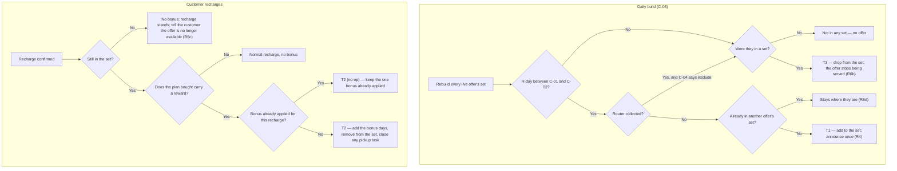

# Renewal Win-Back Offer — bonus days for a lapsed customer who still has the router

> Offer Engine renewal use case, V1. Every day the system builds a set of lapsed customers who still have our router, tells each of them once — in chat and on WhatsApp — that an offer is waiting, and shows it on their recharge screen. They recharge; the bonus days are added and they leave the set. Built on the existing offer engine — no new system.

| | | | |
|---|---|---|---|
| **Owner** — Ashish Raj | **Reviewer** — Akash | **Status** — In review | **Sign-off** — v1.0 signed off · 14 Sep 2026; v1.1 pending |
| **Version** — v1.7 · 16 Sep 2026 | **Consulted — Offer Engine** — Akash | | |

---

## 1. Objective & Definition of Success

**Objective.** A customer who stopped recharging a month ago, and still has our router in their home, hears once that there is a reason to come back — and finds it waiting on the recharge screen when they open the app.

**Boundary.** This spec governs customers between C-01 and C-02 R-days whose router has not been collected (C-04). It covers **more than one live offer at a time**, each over its own cohort, and those cohorts must not overlap (R5d). It leaves unchanged: the Welcome Offer and every acquisition path; the router-recovery flow itself, which keeps running as it does today (R7 is the one touch-point); customers outside the window; and the normal recharge path when no offer applies (AC-REG-1). A recharge keeps every effect it has today, with one deliberate exception: on a plan the offer covers, no coupon applies (R2, G6). For a customer in a win-back set this offer **supersedes the VIP offering** — they get days, not a discount. On every plan the offer does not cover, coupons work exactly as they do now. The bonus days for each plan are **offer data, not spec** — set per offer in the engine (R1). Out of scope: proving lift with a holdout (see Overrides), any service-issue or compensation use case, and price-setting.

**Scope.** Every rule in §2 ships in V1 — the bonus days (R1), one benefit not two (R2), the offer on the recharge screen (R3), the announcements (R4), targeting and the daily set (R5, R6), renewal untouched (R7), and defining these offers in the growth admin panel (R8). Nothing is deferred.

The announcement copy and the WhatsApp template are still to be defined (§4) — the obligation is fixed, the words are not.

R4 announces **once per entry** (R4c) — the safe default for a disengaged audience, not a prohibition. Ops may layer further messaging on through CleverTap; nothing here blocks it.

### Guardrails — promises that hold on every path

| ID | Guardrail | One line | Anchors |
|---|---|---|---|
| G1 | **Days, never price** | The reward is always bonus plan-days — never a discount on the plan or a refund. | R1 · AC-GRD-1 · MQ-5 |
| G2 | **The set is the only audience** | Only a customer in an offer set sees or gets that offer, and never more than one offer at a time. | R3 · R5 · AC-VIS-3 · AC-GRD-2 · MQ-3 |
| G3 | **Applied exactly once** | One customer gets the bonus once per recharge, whatever retries or duplicate confirmations occur. | R1 · T2 · AC-DUP-1 · MQ-2 |
| G4 | **No partner visits a customer who came back** | Once a customer recharges, no field partner is sent to collect their router. | R7 · AC-PICKUP-1 · MQ-4 |
| G5 | **Renewal is untouched** | A recharge keeps doing everything it does today, apart from the one change G6 names. Nothing else moves. | R7 · AC-REG-3 · MQ-8 |
| G6 | **Days or discount, never both** | No recharge ever carries bonus days and a discount at the same time. | R2 · AC-COUPON-1 · AC-GRD-3 · MQ-9 |

### Success metrics

| ID | Metric | Baseline | Target | Source |
|---|---|---|---|---|
| M1 | Share of customers in a win-back set who recharge before leaving it | **19.8%** — measured 14 Sep 2026 over 29,106 customers who reached R30 without recharging | **30%** | MQ-1 |

**Invariant (not a metric):** G2 views by anyone outside the set = 0, zero tolerance. Monitored via MQ-3, not trended.
**Invariant (not a metric):** G4 partner visits to a customer who has recharged = 0, zero tolerance. Monitored via MQ-4, not trended.
**Invariant (not a metric):** G5 existing effects of a recharge lost or delayed = 0, zero tolerance. Monitored via MQ-8, not trended.
**Invariant (not a metric):** G6 recharges carrying both bonus days and a discount = 0, zero tolerance. Monitored via MQ-9, not trended.

**Reading M1 honestly.** There is no holdout (Overrides), so the live number is compared against the 19.8% historical baseline. A general upswing in recharges would move it too. M1 is an adoption measure, not a proof of lift.

**M1 depends on R5f.** The denominator is "who was in the set", and the set is rebuilt every C-03. Unless each day's membership is kept (R5f, MQ-7), that denominator is gone the moment the set is rebuilt and M1 cannot be computed for any past period — nor can any other measurement question be answered retrospectively.

---

## 2. User Stories & Rules

| ID | Story | MUST | MUST NOT |
|---|---|---|---|
| R1 | As a lapsed customer, I get the bonus days on the plan I buy, so the offer is real. | **(a)** Add the bonus days the offer gives for that plan. Launch values: 2+2, 7+7, 14+14. **(b)** Apply them on the recharge confirming, with no action from the customer. **(c)** Grant nothing when the plan bought carries no reward. | Require the customer to claim, redeem or contact support; apply a reward for a plan the offer does not cover. |
| R2 | As a lapsed customer, I get one clear benefit, not a confusing mix — bonus days on the plans the offer covers, my usual coupon on the plans it does not. | **(a)** On a plan the offer covers, apply no coupon, whether auto-applied or entered by hand, and charge the plan’s normal price. **(b)** On a plan the offer does not cover, leave coupons exactly as they work today, including auto-applying the best one the customer holds. **(c)** Tell a customer who holds a coupon why it does not apply on a covered plan. ⚠️ *AI GENERATED — review* **(d)** Leave a coupon that could not be used unspent, so it is still there next time. ⚠️ *AI GENERATED — review* **(e)** While a customer is in a win-back set, do not also target them with the VIP offering. **(f)** When a customer in a set claims a coupon from the coupon page, do not apply it — show them why and send them to the recharge screen. **(g)** Show the recharge screen at the plans’ normal prices, whether the customer arrived from the coupon page or anywhere else — nothing is pre-discounted for a customer in a set. Their coupon still applies at checkout on a plan the offer does not cover (R2b); it is only the discount pre-applied to the list that goes. | Give bonus days and a discount on the same recharge (G6); consume a coupon that was never applied; pre-discount the plan list for a customer in a set. |
| R3 | As a lapsed customer, I see the offer on the plans it applies to when I open the recharge screen, so I know what I get. | **(a)** Mark each plan the offer covers on the recharge list, showing the plan's own days struck through and the resulting total days. **(b)** Leave the plan's price unchanged. **(c)** Leave every plan the offer does not cover exactly as it is today. | Show the offer to anyone outside the set (G2); change any price (G1). |
| R4 | As a lapsed customer, I hear once that an offer is waiting, so I have a reason to open the app. | **(a)** Send one customer-chat message when the customer enters a set. **(b)** Send one WhatsApp message for the same entry. **(c)** Send one of each per entry in V1, and nothing further while the customer stays in that set. Further messaging is a CleverTap campaign, outside this spec and not blocked by it. | Announce a customer who is not in a set; build a hard block that would stop Ops adding CleverTap messaging later. |
| R5 | As a member of the growth team, I target lapsed customers who still have our router, so I spend only where a win-back is possible. | **(a)** Build each offer's set once every C-03. **(b)** Include a customer whose latest plan expired between C-01 and C-02 days ago with no recharge since — whether or not they have taken a win-back offer before. **(c)** Exclude a customer whose router has been collected, unless C-04 says include. **(d)** Put a customer in **at most one** set, so exactly one win-back offer can ever serve them — sets must not overlap. **(e)** Serve the offer only to customers in that set. **(f)** Keep a dated record of every build's membership, so the exact set for any past day can be reconstructed per offer. | Show the offer to anyone outside the set (G2); place one customer in two sets; discard a day's membership once the set is rebuilt. |
| R6 | As a member of the growth team, I want a customer to leave the set the moment they no longer belong in it, so nobody is offered something twice or too late. | **(a)** Remove the customer from the set as soon as their recharge confirms. **(b)** Remove them once they pass C-02, their router is collected, or the offer itself ends. **(c)** If they recharge after leaving, let the recharge stand with no bonus and tell them the offer is no longer available. | Leave a customer in a set after they have recharged; leave a customer who saw the offer with a silent plain recharge and no explanation. |
| R7 | As an operations lead, I want a recharge to keep doing everything it does today, so a returning customer comes off the pickup list exactly as they already do. | **(a)** Leave the existing recharge path intact — a recharge already tells the ticket service, which closes the customer's open router-pickup ticket and pulls the task back from the partner. **(b)** Add the bonus days without altering any effect of a recharge other than the one R2a names — on a covered plan, no coupon applies. | Change, delay or bypass any existing consequence of a recharge beyond that one (G5); leave a pickup task assigned to a partner for a customer who has recharged (G4). |
| R8 | As a member of the growth team, I define and run these offers myself in the existing offer panel, so I can treat different groups differently without waiting on engineering. | **(a)** Let the definer create more than one live win-back offer, each with its own window, bonus days per plan (R1) and cohort rule. **(b)** Reject a new offer whose cohort rule overlaps a live one (R5d). | Require a new admin surface; accept a reward expressed as a price (G1). |

---

## 3. System Behaviour

### 3a. System flow chart

Two triggers: the daily build, and a recharge.

**Precedence — membership is checked again at recharge.** The set is rebuilt only every C-03, so a customer can still be listed and no longer qualify. Membership is re-checked when the recharge confirms, and that check wins (AC-RACE-1).

**Precedence — one set only.** A customer who would qualify for two offers stays in the set they are already in; a new offer never takes them (R5d). This is what keeps a customer on exactly one offer (AC-RACE-2).

### 3b. State transition table — canon

Lifecycle of a customer's **membership of one offer set**.

| ID | From | Action / Trigger | Rule / Check | To | Side-effects |
|---|---|---|---|---|---|
| T1 | — | Daily build (C-03) finds the customer eligible | R-day within C-01..C-02, router not collected (unless C-04), not already in another set | In set | One customer-chat message and one WhatsApp go out once (R4c). The offer appears on the covered plans of the recharge screen (R3). |
| T2 | In set | Recharge confirmed on a covered plan | Still in the set at this instant, plan carries a reward, no bonus already applied for this recharge | Redeemed | The plan's bonus days are added once (R1, G3); the customer leaves the set (R6a); no coupon is applied and none is spent (R2a, R2d, G6); every other existing effect of the recharge runs untouched, including closing any open router-pickup ticket and pulling the task back from the partner (R7, G4, G5). |
| T3 | In set | Passes C-02, router collected, or the offer reaches its end time | — | Dropped | The offer stops being served at the next build. No message is sent — the customer never acted on it. A customer dropped because the offer ended may enter a different live offer’s set at that build (R5d still holds — only one at a time). |
| T4 | Redeemed | Recorded as redeemed, but the bonus days never reach the customer’s plan | — | Redeemed *(recovered)* or escalated | Customer-visible outcome only: the bonus is applied with the recharge, or the case is raised to Support/Ops and the customer told. The paid plan is untouched — it was a real recharge. No separate recovery window is specified; how a failure is retried or surfaced is the implementer’s. |

---

## 4. Screen Requirements

**Master design file:** [Figma · CA Final Dev → Jan 2026 Onwards · node `16374-216849`](https://www.figma.com/design/8OMg9BTNhVDJxQ5ii10OWj/CA-Final-Dev--%3E-Jan-2026-Onwards-Re.wa.Gh.ka.Net?node-id=16374-216849)

That node is the section holding the recharge flow, not a single frame — the frame-level link for each screen below is still to be pinned. ⚠️ *AI GENERATED — review*

### Recharge options — customer app — [Figma · CA Final Dev → Jan 2026 Onwards](https://www.figma.com/design/8OMg9BTNhVDJxQ5ii10OWj/CA-Final-Dev--%3E-Jan-2026-Onwards-Re.wa.Gh.ka.Net?node-id=16374-216849)

The existing "रिचार्ज के विकल्प" list. The offer decorates the plan rows it covers; it is not a separate card.

**States:** offer shown (in a set, on covered plans) · no offer (not in a set — list unchanged) · no longer available (recharged after leaving the set)
**Freshness:** reflects the set as of the last build (C-03); membership is re-checked at recharge

| Element | Source / Routes to | Logic |
|---|---|---|
| Field — offer badge on a plan row | the customer's offer set | an "ऑफर" tag on each plan the offer covers; shown only to a customer in the set (R3a, G2) |
| Field — days transformation | the offer’s bonus days | the plan's own days struck through, then the total: *14 दिन → 28 दिन* (R3a) |
| Field — plain-language line | the offer’s bonus days | one line restating the deal, e.g. "14 दिन के रिचार्ज पे नेट चलेगा 28 दिन" (R3a) |
| Field — plan price | rate card | the plan’s normal price: unchanged by the offer (R3b, G1) and never pre-discounted by a coupon (R2g) |
| Field — uncovered plan rows | rate card | rendered exactly as today, no badge, no strip (R3c) |
| Field — coupon on a covered row | the offer’s bonus days | no coupon entry and no discount; the plan’s normal price stands (R2a, G6) |
| Field — coupon-not-applicable note | the customer’s coupons | shown to a customer holding a coupon on a covered row, saying why it does not apply here ⚠️ *AI GENERATED — review* (R2c) |
| Field — coupon on an uncovered row | the customer’s coupons | works exactly as today; the best coupon the customer holds is applied for them (R2b) |
| Field — no-longer-available notice | recharge after leaving the set | shown when the recharge stands with no bonus, with the reason (R6c) |

### Coupon page — customer app — [Figma · `Frame 427325681`](https://www.figma.com/design/8OMg9BTNhVDJxQ5ii10OWj/CA-Final-Dev--%3E-Jan-2026-Onwards-Re.wa.Gh.ka.Net?node-id=16374-216849)

The existing "कूपन विवरण" list of the coupons a customer holds. For a customer in a win-back set, claiming one explains itself and routes to the recharge screen instead of discounting anything.

**States:** in a set (claiming opens the notice) · not in a set (claiming works as it does today)
**Freshness:** reflects the set as of the last build (C-03)

| Element | Source / Routes to | Logic |
|---|---|---|
| Field — coupon list | the customer’s coupons | unchanged: each coupon, its cap, its code and its expiry, with the running total (R2f) |
| Action — claim a coupon | in a set → the notice below; otherwise today’s behaviour | for a customer in a set the coupon is not applied and not spent (R2d, R2f) |
| Field — notice | offer set membership | tells the customer the benefit comes at recharge, e.g. "रिचार्ज करते समय कूपन का लाभ अपने आप मिल जाएगा" (R2f) |
| Action — notice CTA | the recharge options screen | "रिचार्ज प्लान देखें" — routes to the plan list, which renders at normal prices (R2g) |

### Offer announcement — customer chat — **design to be defined**

**States:** sent (on entry) · not sent (not in a set)
**Freshness:** sent on the build that added the customer (R4a)

| Element | Source / Routes to | Logic |
|---|---|---|
| Field — message body | the offer’s bonus days | names the best bonus available to this customer and routes to the recharge screen (R4a) |
| Rule — send once | offer set entry | one message per entry in V1; nothing further from this system while the customer stays in the set (R4c) |

### Offer announcement — WhatsApp — **template to be defined**

**States:** sent (on entry) · not sent (not in a set)
**Freshness:** sent on the build that added the customer (R4b)

| Element | Source / Routes to | Logic |
|---|---|---|
| Field — template body | the offer’s bonus days | names the best bonus available to this customer (R4b) |
| Rule — send once | offer set entry | one message per entry in V1 (R4c) |

### Offer setup — growth admin — existing offer panel

**States:** editing (draft) · publish-blocked (a publish check failed) · live (inside window) · ended (past end)
**Freshness:** a newly live offer reaches customers at the next build (C-03)

| Element | Source / Routes to | Logic |
|---|---|---|
| Field — cohort rule | growth input | the R-day window (C-01, C-02) and the router-collected switch (C-04) for this offer (R5) |
| Field — reward per plan | growth input · rate-card plans | a whole number of bonus days for each plan; the field takes nothing else (R1a, G1) |
| Field — start / end time | growth input | both required; end after start (R8a) |
| Check — publish guard | — | refuses to publish an offer whose cohort overlaps a live one (R8b, R5d), or whose reward is anything but days (G1) |

---

## 5. Configurability

| ID | Parameter | Default | Range | Who changes it |
|---|---|---|---|---|
| C-01 | Cohort window start — days since plan expiry | 30 | Not constrained | Growth, per offer |
| C-02 | Cohort window end — days since plan expiry | 60 | Not constrained | Growth, per offer |
| C-03 | Offer-set rebuild cadence | Daily | Not constrained | Engineering |
| C-04 | Include customers whose router has been collected | No | Yes / No | Growth, per offer |

---

## 6. Measurement

| ID | The system must be able to answer… | Feeds |
|---|---|---|
| MQ-1 | Of the customers who entered a set in a period, what share recharged before leaving it? | M1 |
| MQ-2 | For each recharge that earned a bonus, was it applied exactly once, and did it apply with the recharge or fail? | G3 invariant · T2 · T4 |
| MQ-3 | Was an offer ever shown to, or applied for, anyone not in its set — or was any customer ever in two sets? | G2 invariant · R5d |
| MQ-4 | Did any partner visit, or stay assigned to, a customer who had already recharged? | G4 invariant |
| MQ-5 | Was any win-back reward ever expressed or applied as a price rather than days? | G1 |
| MQ-6 | For each entry, how many chat and WhatsApp announcements went out, and from which source? | R4c · future CleverTap messaging |
| MQ-7 | For any past day, exactly which customers were in which offer's set? | M1 · R5f · reading MQ-1..MQ-6 retrospectively |
| MQ-8 | Did any recharge by a customer in a set fail to produce an effect that the same recharge produces today? | G5 invariant |
| MQ-9 | Did any recharge ever carry both bonus days and a discount — or a covered-plan recharge consume a coupon? | G6 invariant · R2 |

---

## 7. Acceptance Criteria

### SET — Setting up an offer (R8, R5)

| AC | Given / When / Then | Verifies | Status |
|---|---|---|---|
| AC-SET-1 | **Given** a growth member setting up a win-back offer, **When** they enter 2 bonus days against the 2-day plan, 7 against the 7-day and 14 against the 14-day, with a start and end date, **Then** the offer saves with those bonus days and those dates, and the bonus field takes nothing but a whole number of days. | R1a · R8a | Settled |
| AC-SET-2 | **Given** today's build has finished, **When** an offer's set is opened, **Then** it holds every customer whose plan expired between 30 (C-01) and 60 (C-02) days ago and who has not recharged since, and nobody whose router has already been collected, C-04 being at its default. | R5a · R5b · R5c · C-04 | Settled |
| AC-SET-3 | **Given** a live offer for customers 30 to 45 days past expiry, **When** a growth member tries to publish a second offer covering 40 to 60 days, **Then** publishing is refused, because the two offers would target some of the same customers. | R5d · R8b · G2 | Settled |
| AC-SET-4 | **Given** the build has run daily for a fortnight, with customers joining and leaving throughout, **When** someone asks who was in an offer's set ten days ago, **Then** they get exactly the customers who were in it that day. | R5f · MQ-7 | Settled |
| AC-SET-5 | **Given** a customer who took a win-back offer months ago, recharged, and has since lapsed again to 30 days past expiry with the router still in their home, **When** the build runs, **Then** they join a set again and get a fresh chat and WhatsApp — having taken the offer once does not bar them. | R5b · R4a · R4b | Settled |

### ENTRY — Telling the customer (R4)

| AC | Given / When / Then | Verifies | Status |
|---|---|---|---|
| AC-ENTRY-1 | **Given** a customer who joins an offer's set today, **When** the build finishes, **Then** they get one chat message and one WhatsApp, each saying how many bonus days they can earn. | R4a · R4b | Settled |
| AC-ENTRY-2 | **Given** that customer is still in the set, **When** the build runs again on each of the next five days, **Then** they get no further chat or WhatsApp. | R4c | Settled |

### VIS — What the customer sees (R3)

| AC | Given / When / Then | Verifies | Status |
|---|---|---|---|
| AC-VIS-1 | **Given** a customer in a set whose offer gives 14 bonus days on the 14-day plan, **When** they open the recharge screen, **Then** the 14-day row carries an offer tag, shows "14 दिन" crossed out and "28 दिन" beside it, explains the deal in one line, and still costs ₹305. | R3a · R3b | Settled |
| AC-VIS-2 | **Given** the same screen, **When** the offer covers none of the 1-, 2- and 7-day plans, **Then** those rows look exactly as they do today — no tag, no crossed-out days. | R3c | Settled |
| AC-VIS-3 | **Given** three customers — one 20 days past expiry, one 75 days past, and one 40 days past whose router was collected last week — **When** each opens the recharge screen, **Then** not one of them sees a win-back offer. | R3a · R5 · R5e · G2 | Settled |

### APP — Getting the bonus days (R1)

| AC | Given / When / Then | Verifies | Status |
|---|---|---|---|
| AC-APP-1 | **Given** a customer in a set offered 14 bonus days on the 14-day plan, **When** they pay for it, **Then** their plan shows 28 days the moment the payment confirms, counted in days and never in rupees, and they did nothing to claim it. | R1a · R1b · T2 · G1 | Settled |
| AC-APP-2 | **Given** an offer that covers only the 2-, 7- and 14-day plans, **When** the customer buys the 30-day plan instead, **Then** they get no bonus days and the recharge works as a normal 30-day recharge. | R1c | Settled |

### COUPON — Days or discount, never both (R2, G6)

| AC | Given / When / Then | Verifies | Status |
|---|---|---|---|
| AC-COUPON-1 | **Given** a customer in a set who holds a ₹50 coupon, **When** they open the recharge screen and pick the 14-day plan, which the offer covers, **Then** no coupon is applied, they pay the plan’s normal price, they get 14 bonus days, and they are told why the coupon does not apply here. | R2a · R2c · G6 | Settled |
| AC-COUPON-2 | **Given** that same customer, **When** they pick the 28-day plan instead, which the offer does not cover, **Then** their best coupon is applied for them exactly as it is today, and no bonus days are added. | R2b | Settled |
| AC-COUPON-3 | **Given** that customer took the 14-day plan and the coupon went unused, **When** they look for it afterwards, **Then** the coupon is still theirs, unspent. | R2d | Settled |
| AC-COUPON-4 | **Given** a customer who joins a win-back set, **When** the VIP offering next runs, **Then** it does not target them while they remain in the set. | R2e | Settled |
| AC-COUPON-5 | **Given** a customer in a set who opens the coupon page holding three coupons, **When** they claim one, **Then** no discount is applied, a notice tells them the benefit comes at recharge, and its button takes them to the recharge options screen. | R2f | Settled |
| AC-COUPON-6 | **Given** that customer arriving at the recharge screen from the coupon page, **When** the plan list renders, **Then** every plan shows its normal price with no coupon pre-applied — the covered plans showing bonus days as usual. | R2g · R3a | Settled |
| AC-COUPON-7 | **Given** a customer in a set who claimed a coupon and was sent to the recharge screen, **When** they look at their coupons afterwards, **Then** all three are still there, unspent. | R2d · R2f | Settled |

### EXIT — Leaving the set (R6)

| AC | Given / When / Then | Verifies | Status |
|---|---|---|---|
| AC-EXIT-1 | **Given** a customer in a set, **When** their payment confirms, **Then** they come out of that set, and the next build does not put them back. | R6a · T2 | Settled |
| AC-EXIT-2 | **Given** a customer in a set who does not recharge, **When** they pass 60 days (C-02), or their router is collected, or the offer ends, **Then** the next build takes them out and the offer stops showing. | R6b · T3 | Settled |

### PICKUP — Router recovery (R7)

| AC | Given / When / Then | Verifies | Status |
|---|---|---|---|
| AC-PICKUP-1 | **Given** a customer 40 days past expiry whose router pickup is already assigned to a partner, **When** they recharge, **Then** the pickup closes as *customer recovered*, the job is taken back off the partner, and nobody comes to collect — exactly as happens on a recharge with no offer. | R7a · G4 · G5 | Settled |
| AC-PICKUP-2 | **Given** a customer with no pickup raised against them, **When** they recharge, **Then** the bonus days are added and no pickup is created or closed. | R7 | Settled |

### DUP — The same payment confirmed twice (T2)

| AC | Given / When / Then | Verifies | Status |
|---|---|---|---|
| AC-DUP-1 | **Given** a customer taking an offer of 14 bonus days, **When** the payment confirmation arrives twice, **Then** they end with 28 days, not 42, and come out of the set once. | G3 · T2 | Settled |

### FAIL — When the bonus does not arrive (T4)

| AC | Given / When / Then | Verifies | Status |
|---|---|---|---|
| AC-FAIL-1 | **Given** a customer who paid for a plan the offer covers, **When** the bonus days fail to apply, **Then** the plan they paid for is untouched, and Support/Ops picks the case up and tells them — nobody is left having paid for bonus days that never appear. | T4 | Settled |

### RACE — Acting too late (§3a)

| AC | Given / When / Then | Verifies | Status |
|---|---|---|---|
| AC-RACE-1 | **Given** a customer who was in yesterday's set at 60 days past expiry, **When** they recharge today, now 61 days past and outside the window, **Then** they get no bonus days, the recharge still goes through, and the app tells them the offer is no longer available. | R6c · §3a precedence | Settled |
| AC-RACE-2 | **Given** a customer already in offer A's set, **When** offer B goes live and would also match them, **Then** they stay in A's set, see only A's offer, and get no second message. | R5d · G2 | Settled |

### BV — The edges of the window (C-01, C-02)

| AC | Given / When / Then | Verifies | Status |
|---|---|---|---|
| AC-BV-1 | **Given** a set built for customers 30 (C-01) to 60 (C-02) days past expiry, **When** customers at 29, 30, 60 and 61 days are checked, **Then** the 30- and 60-day customers are in it and the 29- and 61-day ones are not. | R5b · C-01 · C-02 | Settled |

### CFG — Changing the window (C-02)

| AC | Given / When / Then | Verifies | Status |
|---|---|---|---|
| AC-CFG-1 | **Given** the end of the window moved from 60 to 90 days, **When** the next build runs, **Then** customers between 61 and 90 days past expiry join the set, get their one chat and WhatsApp, and see the offer; customers past 90 days do not. | C-02 · C-03 · R4a · R5b | Settled |

### WF — The whole journey (T1, T2)

| AC | Given / When / Then | Verifies | Status |
|---|---|---|---|
| AC-WF-1 | **Given** a customer 40 days past expiry who still has the router and has a pickup assigned, **When** they join the set, get the chat and WhatsApp, open the app and buy the 14-day plan, **Then** they end up with 28 days, come out of the set, their pickup closes and comes off the partner, nobody visits, and they never had to contact support. | T1 · T2 · R1 · R3 · R4 · R6a · R7 · G1 · G4 | Settled |

### REG — Leaving everything else alone (§1 Boundary)

| AC | Given / When / Then | Verifies | Status |
|---|---|---|---|
| AC-REG-1 | **Given** a customer in no win-back set, **When** they open the recharge screen and pay, **Then** the screen looks as it does today, the recharge works as it does today, and no message is sent. | Boundary · R3c | Settled |
| AC-REG-2 | **Given** someone still signing up as a new customer, **When** a win-back offer is live, **Then** their Welcome Offer works as before and they never see a win-back offer. | Boundary · G2 | Settled |
| AC-REG-4 | **Given** a customer in no win-back set, **When** they recharge on any plan, **Then** their coupons and the VIP offering work exactly as they do today — nothing about this feature reaches them. | Boundary · G6 | Settled |
| AC-REG-5 | **Given** a customer in no win-back set, **When** they claim a coupon from the coupon page, **Then** it is applied as it is today and the plan list shows the discounted prices — no notice, no change. | Boundary · R2f | Settled |
| AC-REG-3 | **Given** a customer in a win-back set, **When** they recharge, **Then** everything a recharge normally does still happens — the plan starts, the pickup closes and comes off the partner, the mandate is handled, the usual messages go out — and the only differences are the bonus days and, on a covered plan, the absent coupon (R2a). | G5 · R7b | Settled |

### GRD — Guardrails

| AC | Given / When / Then | Verifies | Status |
|---|---|---|---|
| AC-GRD-1 | **Given** a win-back offer, **When** the reward is checked at setup, on the recharge screen, and on the plan the customer ends up with, **Then** it is bonus days every time — never a discount, a lower price, or money back. | G1 | Settled |
| AC-GRD-2 | **Given** a live win-back offer, **When** the recharge screen, the chat and the WhatsApp message are checked for a customer not in its set, **Then** that customer was never shown the offer and never given its bonus days. | G2 | Settled |
| AC-GRD-3 | **Given** every recharge by a customer in a win-back set, **When** each is inspected end to end, **Then** not one carries both bonus days and a discount. | G6 | Settled |

---

## 8. Glossary

| Term | Meaning | Owner (domain) |
|---|---|---|
| R-day | Days since a customer's latest plan expired with no recharge since. R30 = thirty days past expiry. | Customer lifecycle |
| Offer set | **Canonical definition:** the list of customers an offer is served to, rebuilt every C-03 from that offer's cohort rule. A customer belongs to at most one set (R5d). Being in the set is the whole of eligibility. | Growth |
| Cohort rule | An offer's membership test: an R-day window (C-01, C-02) plus the router-collected switch (C-04). | Growth |
| Entry | The moment a build adds a customer to a set. Announcements are counted per entry (R4c). A customer who wins back, lapses again and re-qualifies makes a **new** entry — they rejoin a set and are announced to again. | Growth |
| Coupon | A discount a customer holds and can put against a recharge. Today the best one is applied for them automatically. On a plan this offer covers, none applies (R2a). | Growth |
| VIP Offer | The live offering that gives discounts through coupons. It keeps running for everyone outside a win-back set; for a customer inside one, this offer supersedes it (R2e). | Growth |
| Router not collected | No **completed** router-pickup for this customer. An open or assigned pickup task does not disqualify them — only a pickup that actually happened does; that task is closed on recharge instead (R7). Once the router has actually gone the customer has no connection, so there is nothing left to recharge and they cannot come back through this offer at all — they are dropped from the set for hygiene, not because they might act too late (R6b, T3). | Router Recovery / Ops |

---

## 9. Notes for System Capabilities

The existing offer engine supplies most of this. These are the gaps, verified against the deployed branch on 14 Sep 2026 (`customer-offer-service` @ `offer-enhancement`).

| Capability | Needed by | State today |
|---|---|---|
| **Renewal offers must respect their audience.** A renewal-type offer currently skips the audience check entirely and matches every customer with a location on file. | R5 · G2 · MQ-3 | **Blocker.** Must be fixed before any renewal offer is published, including a test one. |
| Serve an offer to a supplied set of customers rather than an area, and hold several such sets at once without overlap. | R5 · R8 · G2 | Not supported — audience is one area, and only one per offer. |
| Build each live offer's set on a schedule, and drop a customer from it on recharge, window exit or router collection. | R5a · R6 · T1 · T3 | Not supported — there is no scheduled cohort build. |
| Ask for, and show, a live offer on the recharge options screen, decorating the covered plan rows. | R3 | Not supported — the offer lookup is wired only into the new-customer payment screen. |
| Tell the offer engine a recharge has confirmed, so the bonus is granted. | R1b · T2 | An entry point exists and matches the estate's event convention, but nothing sends to it today. |
| Send one chat and one WhatsApp on entry. | R4 · MQ-6 | Messaging exists for the acquisition flow and is driven by booking; nothing drives it from an offer set. Keep the trigger loose enough that Ops can add CleverTap messaging on the same signal later. |
| Apply the bonus with the recharge, or raise the failure. | T4 · AC-FAIL-1 | A recovery job exists in the engine but is switched off, and its escalation is a log line rather than a notification. Whatever is used, a failed bonus must not end as a silent log. |
| Close an open router-pickup ticket on recharge and pull the task back from the partner. | R7 · G4 · G5 | **Already works — the requirement is not to break it.** Verified 14 Sep 2026: `CustomerFunctions` raises the recharge event *"so cash-collect / router-pickup tickets are closed"*, `TaskExecutionService.informTicketService` publishes `CUSTOMER_RECHARGED_V2` to the ticket queue, and `TicketServiceImpl.closeTicket` closes a `ROUTER_PICKUP` ticket, logs `CUSTOMER_RECOVERED`, and pulls a partner-assigned task back to Wiom. No new build — a regression risk only. |
| Decide coupon eligibility per plan row, and suppress coupon auto-apply on the rows this offer covers. | R2a · R2b · G6 | Not supported — coupon auto-apply does not know about offers. Measured 15 Sep 2026: 57% of win-back recharges carry a coupon today, so this path is exercised constantly, not rarely. |
| Let the coupon page know whether the customer is in a win-back set, so claiming a coupon can route rather than discount. | R2f · R2g | Not supported — the coupon page has no notion of offers. |
| Hold the VIP offering back from customers in a win-back set. | R2e | Not supported, and it is not this engine’s to do — it needs whoever owns VIP targeting to read the set. |
| Record every offer served, announced, applied and suppressed, so measurement can read it. | MQ-1..MQ-6 · MQ-8 | Partly present — the engine logs one line per offer decision with a reason. Announcements and set membership are new. |
| **Keep each day's set membership, queryable per offer per date.** Rebuilding a set must add a dated record, never overwrite the last one. | R5f · M1 · MQ-7 · AC-SET-4 | Not supported — there is no set, so no history of one. Without this the feature cannot be measured after the fact. |

---

## Overrides

| Rule overridden | What was done instead | Rationale | Approved by |
|---|---|---|---|
| §1 — a success metric should support a causal read | M1 is measured against a historical baseline with **no holdout** | PM chose to ship uncontrolled and add a holdout later. Accepted with the consequence recorded in §1 "Reading M1 honestly": ~20% of this cohort returns unaided, so the majority of grants will go to customers who were coming back anyway, and that share cannot be measured under this design. | Ashish Raj (PM) |
| §4 — every screen block has a design link | The chat and WhatsApp announcement blocks say **to be defined** instead | The design and the WhatsApp template have not been written yet. The app screen has its Figma node. | Ashish Raj (PM) |
| §3b T4 — an unbounded moment must sit inside a C-id window | The failure envelope has no deadline: the bonus applies with the recharge, or the case is raised to Support/Ops | PM removed the bonus-application recovery window. The bonus applies in the same operation as the recharge rather than on a timer, so a window implied a retry loop nobody is building. The cost is that a customer whose bonus fails has no guaranteed time by which they are told — the obligation is only that the case reaches Support/Ops (AC-FAIL-1). | Ashish Raj (PM) |
| §5 / L8 — every C-id carries a default, a range and an owner | The four C-ids carry defaults and owners; their ranges read **Not constrained** | PM dropped the ranges at finalise. The defaults are his; the ranges were invented and never reviewed, and bounding what growth may set added false precision without adding safety. Growth sets what they need; changing a default is an offer edit, not a spec change. | Ashish Raj (PM) |
| §2 R1a — every number outside §5 is a C-id | The launch reward values 2+2, 7+7 and 14+14 are named in R1a | PM’s instruction: the bonus days belong to the offer engine, not the spec. The values are recorded as launch data so engineering has something concrete to build against; changing them is an offer edit, not a spec change. | Ashish Raj (PM) |

---

## AI-generated content for review

| Location | What was generated | Basis |
|---|---|---|
| §2 R2c · §4 · AC-COUPON-1 | That a customer holding a coupon is **told** why it does not apply on a covered plan | The PM gave the rule, not the wording. Flagged because 59% of win-back recharges have a coupon auto-applied today: if that discount is currently baked into the price shown on the row, switching it off makes the plan look **more expensive** at the moment we are trying to win the customer back. Silence would read as a price rise with a badge on it. |
| §4 | That the master design node is the section holding the flow, and that a frame-level link per screen is still to be pinned | The PM supplied the file and the section node; the individual screen frames were not named. **Pin them, or tell me the frame names and I will.** |
| §2 R2d · AC-COUPON-3 | That an unusable coupon is left unspent | Inference. Nobody said it should be consumed, but nobody said it should not, and a silently burned coupon is a real harm. **Confirm with whoever owns coupons.** |
