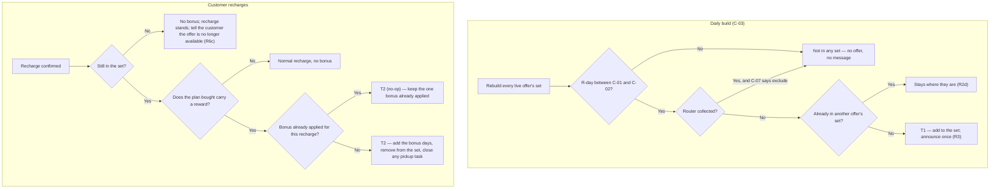

# Renewal Win-Back Offer — bonus days for a lapsed customer who still has the router

> Offer Engine renewal use case, V1. Every day the system builds a set of lapsed customers who still have our router, tells each of them once — in chat and on WhatsApp — that an offer is waiting, and shows it on their recharge screen. They recharge; the bonus days are added and they leave the set. Built on the existing offer engine — no new system.

| | | | |
|---|---|---|---|
| **Owner** — Ashish Raj | **Reviewer** — [Eng lead] ⚠️ *AI GENERATED — review* | **Status** — Draft | **Sign-off** — Pending |
| **Version** — v0.5 · 14 Sep 2026 | **Consulted — Offer Engine** — [name] ⚠️ *AI GENERATED — review* | **Consulted — Router Recovery / Ops** — [name] ⚠️ *AI GENERATED — review* | **Consulted — Comms / Growth** — [name] ⚠️ *AI GENERATED — review* |

---

## 1. Objective & Definition of Success

**Objective.** A customer who stopped recharging a month ago, and still has our router in their home, hears once that there is a reason to come back — and finds it waiting on the recharge screen when they open the app.

**Boundary.** This spec governs customers between C-01 and C-02 R-days whose router has not been collected (C-07). It covers **more than one live offer at a time**, each over its own cohort, and those cohorts must not overlap (R2d). It leaves unchanged: the Welcome Offer and every acquisition path; the router-recovery flow itself, which keeps running as it does today (R7 is the one touch-point); customers outside the window; and the normal recharge path when no offer applies (AC-REG-1). A recharge keeps every effect it has today; the offer only adds days (G6). The reward map is **offer data, not spec** — set per offer in the engine (R5). Out of scope: proving lift with a holdout (see Overrides), any service-issue or compensation use case, and price-setting. **Repeat or reminder messaging is also out of scope** — V1 announces once per entry (R3d) because that is the safe default for a disengaged audience, not because more is forbidden. Ops may layer further messaging on through CleverTap later; nothing in this spec blocks it.

### Guardrails — promises that hold on every path

| ID | Guardrail | One line | Anchors |
|---|---|---|---|
| G1 | **Days, never price** | The reward is always bonus plan-days — never a discount on the plan or a refund. | R5 · AC-GRD-1 · MQ-5 |
| G2 | **The set is the only audience** | Only a customer in an offer set sees or gets that offer, and never more than one offer at a time. | R2 · R4 · AC-VIS-2 · AC-GRD-2 · MQ-3 |
| G3 | **Applied exactly once** | One customer gets the bonus once per recharge, whatever retries or duplicate confirmations occur. | R5 · T2 · AC-DUP-1 · MQ-2 |
| G4 | **No partner visits a customer who came back** | Once a customer recharges, no field partner is sent to collect their router. | R7 · AC-PICKUP-1 · MQ-4 |
| G6 | **Renewal is untouched** | A recharge keeps doing everything it does today. The offer adds bonus days on top and changes nothing else. | R7 · AC-REG-3 · MQ-8 |

### Success metrics

| ID | Metric | Baseline | Target | Source |
|---|---|---|---|---|
| M1 | Share of customers in a win-back set who recharge before leaving it | **19.8%** — measured 14 Sep 2026 over 29,106 customers who reached R30 without recharging | **30%** | MQ-1 |

**Invariant (not a metric):** G2 views by anyone outside the set = 0, zero tolerance. Monitored via MQ-3, not trended.
**Invariant (not a metric):** G4 partner visits to a customer who has recharged = 0, zero tolerance. Monitored via MQ-4, not trended.
**Invariant (not a metric):** G6 existing effects of a recharge lost or delayed = 0, zero tolerance. Monitored via MQ-8, not trended.

**Reading M1 honestly.** There is no holdout (Overrides), so the live number is compared against the 19.8% historical baseline. A general upswing in recharges would move it too. M1 is an adoption measure, not a proof of lift.

**M1 depends on R2f.** The denominator is "who was in the set", and the set is rebuilt every C-03. Unless each day's membership is kept (R2f, MQ-7), that denominator is gone the moment the set is rebuilt and M1 cannot be computed for any past period — nor can any other measurement question be answered retrospectively.

---

## 2. User Stories & Rules

| ID | Story | MUST | MUST NOT |
|---|---|---|---|
| R1 | As a member of the growth team, I run several win-back offers at once from the existing offer panel, so I can treat different groups differently without a new tool. | **(a)** Let the definer create more than one live win-back offer, each with its own window, reward map (R5) and cohort rule. **(b)** Reject a new offer whose cohort rule overlaps a live one (R2d). | Require a new admin surface; accept a reward expressed as a price (G1). |
| R2 | As a member of the growth team, I target lapsed customers who still have our router, so I spend only where a win-back is possible. | **(a)** Build each offer's set once every C-03. **(b)** Include a customer whose latest plan expired between C-01 and C-02 days ago with no recharge since. **(c)** Exclude a customer whose router has been collected, unless C-07 says include. **(d)** Put a customer in **at most one** set — sets must not overlap. **(e)** Serve the offer only to customers in that set. **(f)** Keep a dated record of every build's membership, so the exact set for any past day can be reconstructed per offer, for C-09. | Show the offer to anyone outside the set (G2); place one customer in two sets; discard a day's membership once the set is rebuilt. |
| R3 | As a lapsed customer, I hear once that an offer is waiting, so I have a reason to open the app. | **(a)** Send one customer-chat message when the customer enters a set. **(b)** Send one WhatsApp message for the same entry. **(c)** Send both within C-08 of the set being built. **(d)** Send one of each per entry in V1, and nothing further while the customer stays in that set. Further messaging is a CleverTap campaign, outside this spec and not blocked by it. | Announce a customer who is not in a set; build a hard block that would stop Ops adding CleverTap messaging later. |
| R4 | As a lapsed customer, I see the offer on the plans it applies to when I open the recharge screen, so I know what I get. | **(a)** Mark each plan the offer covers on the recharge list, showing the plan's own days struck through and the resulting total days. **(b)** Leave the plan's price unchanged. **(c)** Leave every plan the offer does not cover exactly as it is today. | Show the offer to anyone outside the set (G2); change any price (G1). |
| R5 | As a lapsed customer, I get the bonus days on the plan I buy, so the offer is real. | **(a)** Add the bonus days set for that plan in the offer's reward map. Launch values: 2+2, 7+7, 14+14. **(b)** Apply them on the recharge confirming, with no action from the customer. **(c)** Grant nothing when the plan bought carries no reward. | Require the customer to claim, redeem or contact support; apply a reward for a plan the offer does not cover. |
| R6 | As a member of the growth team, I want a customer to leave the set the moment they no longer belong in it, so nobody is offered something twice or too late. | **(a)** Remove the customer from the set as soon as their recharge confirms. **(b)** Remove them once they pass C-02, or their router is collected. **(c)** If they recharge after leaving, let the recharge stand with no bonus and tell them the offer is no longer available. | Leave a customer in a set after they have recharged; leave a customer who saw the offer with a silent plain recharge and no explanation. |
| R7 | As an operations lead, I want a recharge to keep doing everything it does today, so a returning customer comes off the pickup list exactly as they already do. | **(a)** Leave the existing recharge path intact — a recharge already tells the ticket service, which closes the customer's open router-pickup ticket and pulls the task back from the partner. **(b)** Add the bonus days without altering any other effect of a recharge. | Change, delay or bypass any existing consequence of a recharge (G6); leave a pickup task assigned to a partner for a customer who has recharged (G4). |

---

## 3. System Behaviour

### 3a. System flow chart

Two triggers: the daily build, and a recharge.

**Precedence — membership is checked again at recharge.** The set is rebuilt only every C-03, so a customer can still be listed and no longer qualify. Membership is re-checked when the recharge confirms, and that check wins (AC-RACE-1).

**Precedence — one set only.** A customer who would qualify for two offers stays in the set they are already in; a new offer never takes them (R2d). This is what makes C-04 hold (AC-RACE-2).

### 3b. State transition table — canon

Lifecycle of a customer's **membership of one offer set**.

| ID | From | Action / Trigger | Rule / Check | To | Side-effects |
|---|---|---|---|---|---|
| T1 | — | Daily build (C-03) finds the customer eligible | R-day within C-01..C-02, router not collected (unless C-07), not already in another set | In set | One customer-chat message and one WhatsApp go out within C-08, once (R3d). The offer appears on the covered plans of the recharge screen (R4). |
| T2 | In set | Recharge confirmed on a covered plan | Still in the set at this instant, plan carries a reward, no bonus already applied for this recharge | Redeemed | The plan's bonus days are added once (R5, G3); the customer leaves the set (R6a); the recharge's existing effects all run untouched, including closing any open router-pickup ticket and pulling the task back from the partner (R7, G4, G6). |
| T3 | In set | Passes C-02, or router collected | — | Dropped | The offer stops being served at the next build. No message is sent — the customer never acted on it. |
| T4 | Redeemed | Bonus not applied within C-06 of a valid recharge | — | Redeemed *(recovered)* or escalated | Customer-visible outcome only: by C-06 the bonus is applied, or the case is escalated to Support/Ops with the customer notified. The paid plan is untouched — it was a real recharge. Recovery inside the window is the implementer's. |

---

## 4. Screen Requirements

**Master design file:** [Figma · CA July Sprint 2026 · node `772-52553`](https://www.figma.com/design/3uNA2Hev2B2BdEBdb7b9Ro/CA-July-Sprint-2026?node-id=772-52553)

### Recharge options — customer app — [Figma node `772-52553`](https://www.figma.com/design/3uNA2Hev2B2BdEBdb7b9Ro/CA-July-Sprint-2026?node-id=772-52553)

The existing "रिचार्ज के विकल्प" list. The offer decorates the plan rows it covers; it is not a separate card.

**States:** offer shown (in a set, on covered plans) · no offer (not in a set — list unchanged) · no longer available (recharged after leaving the set)
**Freshness:** reflects the set as of the last build (C-03); membership is re-checked at recharge

| Element | Source / Routes to | Logic |
|---|---|---|
| Field — offer badge on a plan row | the customer's offer set | an "ऑफर" tag on each plan the offer covers; shown only to a customer in the set (R4a, G2) |
| Field — days transformation | offer reward map | the plan's own days struck through, then the total: *14 दिन → 28 दिन* (R4a) |
| Field — plain-language line | offer reward map | one line restating the deal, e.g. "14 दिन के रिचार्ज पे नेट चलेगा 28 दिन" (R4a) |
| Field — plan price | rate card | unchanged by the offer (R4b, G1) |
| Field — uncovered plan rows | rate card | rendered exactly as today, no badge, no strip (R4c) |
| Field — no-longer-available notice | recharge after leaving the set | shown when the recharge stands with no bonus, with the reason (R6c) |

### Offer announcement — customer chat — [design link needed]

**States:** sent (on entry) · not sent (not in a set)
**Freshness:** sent within C-08 of the build that added the customer (R3a, R3c)

| Element | Source / Routes to | Logic |
|---|---|---|
| Field — message body | offer reward map | names the best bonus available to this customer and routes to the recharge screen (R3a) |
| Rule — send once | offer set entry | one message per entry in V1; nothing further from this system while the customer stays in the set (R3d) |

### Offer announcement — WhatsApp — [template link needed]

**States:** sent (on entry) · not sent (not in a set)
**Freshness:** sent within C-08 of the build that added the customer (R3b, R3c)

| Element | Source / Routes to | Logic |
|---|---|---|
| Field — template body | offer reward map | names the best bonus available to this customer (R3b) |
| Rule — send once | offer set entry | one message per entry in V1 (R3d) |

### Offer setup — growth admin — existing offer panel

**States:** editing (draft) · publish-blocked (a publish check failed) · live (inside window) · ended (past end)
**Freshness:** a newly live offer reaches customers at the next build (C-03)

| Element | Source / Routes to | Logic |
|---|---|---|
| Field — cohort rule | growth input | the R-day window (C-01, C-02) and the router-collected switch (C-07) for this offer (R2) |
| Field — reward per plan | growth input · rate-card plans | whole bonus days per plan_id; a price value is rejected (R5a, G1) |
| Field — start / end time | growth input | both required; end after start (R1a) |
| Check — publish guard | — | blocks a price-shaped reward, an offer with no reward set, and an offer whose cohort rule overlaps a live one (R1b, R2d) |

---

## 5. Configurability

| ID | Parameter | Default | Range | Who changes it |
|---|---|---|---|---|
| C-01 | Cohort window start — days since plan expiry | 30 | 15–45 ⚠️ *AI GENERATED — review* | Growth, per offer |
| C-02 | Cohort window end — days since plan expiry | 60 | 45–120 ⚠️ *AI GENERATED — review* | Growth, per offer |
| C-03 | Offer-set rebuild cadence | Daily | Daily only in V1 ⚠️ *AI GENERATED — review* | Engineering |
| C-04 | Max live win-back offers serving one customer | 1 | Fixed in V1 ⚠️ *AI GENERATED — review* | Product |
| C-06 | Bonus-application recovery window — the outer deadline by which the system must apply the bonus or escalate | 10 min | 5–30 min ⚠️ *AI GENERATED — review* | PM + Eng |
| C-07 | Include customers whose router has been collected | No | Yes / No | Growth, per offer |
| C-08 | Announcement send window after the set is built | 2 h | 15 min – 12 h ⚠️ *AI GENERATED — review* | PM + Comms |
| C-09 | How long each day's set membership is kept and queryable | 24 months | 12–60 months ⚠️ *AI GENERATED — review* | PM + Data |

---

## 6. Measurement

| ID | The system must be able to answer… | Feeds |
|---|---|---|
| MQ-1 | Of the customers who entered a set in a period, what share recharged before leaving it? | M1 |
| MQ-2 | For each recharge that earned a bonus, was it applied exactly once, and within C-06? | G3 invariant · T2 · T4 |
| MQ-3 | Was an offer ever shown to, or applied for, anyone not in its set — or was any customer ever in two sets? | G2 invariant · R2d |
| MQ-4 | Did any partner visit, or stay assigned to, a customer who had already recharged? | G4 invariant |
| MQ-5 | Was any win-back reward ever expressed or applied as a price rather than days? | G1 |
| MQ-6 | For each entry, how many chat and WhatsApp announcements went out, and from which source? | R3d · future CleverTap messaging |
| MQ-7 | For any past day, exactly which customers were in which offer's set? | M1 · R2f · every other MQ |
| MQ-8 | Did any recharge by a customer in a set fail to produce an effect that the same recharge produces today? | G6 invariant |

---

## 7. Acceptance Criteria

### SET — Offer setup and cohort build (R1, R2)

| AC | Given / When / Then | Verifies | Status |
|---|---|---|---|
| AC-SET-1 | **Given** a growth member creating a win-back offer, **When** they set the reward map to 2+2, 7+7 and 14+14 with a start and end time, **Then** the offer saves with that map and window, and the reward field accepts only whole bonus days — a price value blocks publish. | R1a · R5a · G1 | Settled |
| AC-SET-2 | **Given** the daily build has run, **When** a set is inspected, **Then** it holds every customer whose latest plan expired between C-01 [30] and C-02 [60] days ago with no recharge since, and none whose router has been collected. | R2a · R2b · R2c | Settled |
| AC-SET-3 | **Given** a live offer covering R30–R45, **When** a growth member tries to publish a second offer covering R40–R60, **Then** publish is blocked for overlapping cohorts; **and When** they change it to R46–R60 instead, **Then** it publishes and no customer appears in both sets. | R1b · R2d · G2 | Settled |
| AC-SET-4 | **Given** an offer whose C-07 is set to Yes, **When** the set is built, **Then** customers whose router has been collected are included. | C-07 · R2c | Settled |
| AC-SET-5 | **Given** the build has run every day for a fortnight and customers have joined and left throughout, **When** the membership of each offer's set is asked for as it stood ten days ago, **Then** exactly the customers in it that day are returned, per offer, unchanged by every rebuild since. | R2f · C-09 · MQ-7 | Settled |

### ENTRY — Announcement (R3)

| AC | Given / When / Then | Verifies | Status |
|---|---|---|---|
| AC-ENTRY-1 | **Given** a customer added to a set by today's build, **When** C-08 [2 h] has passed, **Then** they have received exactly one customer-chat message and one WhatsApp message, each naming the bonus available to them. | R3a · R3b · R3c | Settled |
| AC-ENTRY-2 | **Given** that same customer still in the set, **When** the build runs again on each of the next five days, **Then** this system sends no further chat or WhatsApp. | R3d | Settled |

### VIS — Visibility (R4, G2)

| AC | Given / When / Then | Verifies | Status |
|---|---|---|---|
| AC-VIS-1 | **Given** a customer in a set whose offer covers the 14-day plan at +14, **When** they open the recharge options screen, **Then** that row shows an offer badge, "14 दिन" struck through leading to "28 दिन", a line restating the deal, and the price unchanged at ₹305. | R4a · R4b | Settled |
| AC-VIS-2 | **Given** the same screen, **When** the 1-, 2- and 7-day rows are inspected and the offer covers none of them, **Then** each renders exactly as it does today, with no badge and no strip. | R4c | Settled |
| AC-VIS-3 | **Given** three customers — one at R20, one at R75, and one at R40 whose router was collected last week — **When** each opens the recharge screen, **Then** none of them sees any win-back offer. | R2 · R4a · G2 | Settled |

### APP — Bonus applied (T2, R5)

| AC | Given / When / Then | Verifies | Status |
|---|---|---|---|
| AC-APP-1 | **Given** a customer in a set shown a 14+14 offer, **When** they recharge on the 14-day plan, **Then** within C-06 [10 min] they have 28 total days, shown as days with no rupee figure, and no action was required of them. | R5a · R5b · T2 · G1 | Settled |
| AC-APP-2 | **Given** the same offer covering only the 2-, 7- and 14-day plans, **When** the customer recharges on a 30-day plan, **Then** no bonus is added and the recharge stands as a normal 30-day recharge. | R5c | Settled |

### EXIT — Leaving the set (R6, T3)

| AC | Given / When / Then | Verifies | Status |
|---|---|---|---|
| AC-EXIT-1 | **Given** a customer in a set, **When** their recharge confirms, **Then** they are no longer in that set, and the next build does not re-add them. | R6a · T2 | Settled |
| AC-EXIT-2 | **Given** a customer in a set who does not recharge, **When** they pass C-02 [60] or their router is collected, **Then** the next build drops them and the offer stops being served, with no message sent. | R6b · T3 | Settled |

### PICKUP — Router recovery (R7, G4)

| AC | Given / When / Then | Verifies | Status |
|---|---|---|---|
| AC-PICKUP-1 | **Given** a customer at R40 with an open router-pickup ticket assigned to a partner, **When** they recharge with the offer applied, **Then** the ticket closes as *customer recovered*, the task is pulled back from the partner, and no visit follows — exactly as it does for a recharge with no offer. | R7a · G4 · G6 | Settled |
| AC-PICKUP-2 | **Given** a customer with no pickup task at all, **When** they recharge, **Then** the bonus applies normally and nothing is created or closed. | R7 | Settled |

### DUP — Duplicate trigger (T2, G3)

| AC | Given / When / Then | Verifies | Status |
|---|---|---|---|
| AC-DUP-1 | **Given** a customer availing a 14+14 offer, **When** their recharge confirmation fires twice, **Then** the bonus is added exactly once — 28 total days, never 42 — and they leave the set once. | G3 · T2 | Settled |

### FAIL — Failure window (T4)

| AC | Given / When / Then | Verifies | Status |
|---|---|---|---|
| AC-FAIL-1 | **Given** a valid recharge whose bonus has not appeared, **When** C-06 [10 min] is reached, **Then** the bonus is either applied or the case is escalated to Support/Ops with the customer notified, and the paid plan is unaffected. | T4 · C-06 | Settled |

### RACE — Precedence (§3a)

| AC | Given / When / Then | Verifies | Status |
|---|---|---|---|
| AC-RACE-1 | **Given** a customer listed in this morning's set, **When** they recharge this afternoon having passed C-02 overnight — or after their router was collected this morning — **Then** no bonus is added, the recharge stands, and the app tells them the offer is no longer available. | R6c · §3a precedence | Settled |
| AC-RACE-2 | **Given** a customer already in offer A's set, **When** a new offer B publishes whose cohort would also match them, **Then** they stay in A's set only, see only A's offer, and receive no second announcement. | R2d · C-04 · G2 | Settled |

### BV — Boundary values (C-01, C-02 edges)

| AC | Given / When / Then | Verifies | Status |
|---|---|---|---|
| AC-BV-1 | **Given** a set built with C-01 [30] and C-02 [60], **When** it is checked for customers at R29, R30, R60 and R61, **Then** the R30 and R60 customers are in it and the R29 and R61 customers are not. | R2b · C-01 · C-02 | Settled |

### CFG — Configurability (C-02)

| AC | Given / When / Then | Verifies | Status |
|---|---|---|---|
| AC-CFG-1 | **Given** C-02 changed from 60 to 90, **When** the next build runs (C-03), **Then** customers between R61 and R90 enter the set, are announced to once, and see the offer; customers past R90 do not. | C-02 · C-03 · R2b · R3a | Settled |

### WF — Workflow (T1, T2)

| AC | Given / When / Then | Verifies | Status |
|---|---|---|---|
| AC-WF-1 | **Given** a customer at R40 whose router is still with them and an open pickup task, **When** they are added by the daily build, receive the chat and WhatsApp, open the app, and recharge on the 14-day plan, **Then** they end with 28 days shown as days, they leave the set, the pickup task closes as *customer recharged*, no partner visits, and no support contact or manual step was needed anywhere in the journey. | T1 · T2 · R3 · R4 · R5 · R6a · R7 · G1 · G4 | Settled |

### REG — Regression (§1 Boundary)

| AC | Given / When / Then | Verifies | Status |
|---|---|---|---|
| AC-REG-1 | **Given** a customer in no win-back set, **When** they open the recharge screen and recharge, **Then** the list renders as it does today, the normal recharge path runs, and no message was sent. | Boundary · R4c | Settled |
| AC-REG-2 | **Given** a new lead in the acquisition flow, **When** a win-back offer is live, **Then** their Welcome Offer experience is unchanged and they never see a win-back offer. | Boundary · G2 | Settled |
| AC-REG-3 | **Given** a customer in a win-back set, **When** they recharge, **Then** every existing consequence of a recharge happens unchanged — the plan is created, the open pickup ticket closes and its task is pulled back, the mandate is handled, the usual messages fire — and the only difference from a recharge with no offer is the bonus days. | G6 · R7b | Settled |

### GRD — Guardrails

| AC | Given / When / Then | Verifies | Status |
|---|---|---|---|
| AC-GRD-1 | **Given** any win-back offer on any path, **When** its reward is inspected end to end, **Then** it is always bonus plan-days, never a price, discount or refund. | G1 | Settled |
| AC-GRD-2 | **Given** any live win-back offer, **When** every surface is checked against a customer not in its set, **Then** the offer was never shown or applied to them. | G2 | Settled |

---

## 8. Glossary

| Term | Meaning | Owner (domain) |
|---|---|---|
| R-day | Days since a customer's latest plan expired with no recharge since. R30 = thirty days past expiry. | Customer lifecycle |
| Offer set | **Canonical definition:** the list of customers an offer is served to, rebuilt every C-03 from that offer's cohort rule. A customer belongs to at most one set (R2d). Being in the set is the whole of eligibility. | Growth |
| Cohort rule | An offer's membership test: an R-day window (C-01, C-02) plus the router-collected switch (C-07). | Growth |
| Entry | The moment a build adds a customer to a set. Announcements are counted per entry (R3d). | Growth |
| Router not collected | No **completed** router-pickup for this customer. An open or assigned pickup task does not disqualify them — only a pickup that actually happened does. That task is closed on recharge instead (R7). A customer leaves a set for exactly two reasons: the router was collected, or they recharged (R6). | Router Recovery / Ops |
| Reward map | The offer's plan_id → bonus-days table, set in the offer panel. Launch values 2+2, 7+7, 14+14. Offer data, not spec. | Growth |

---

## 9. Notes for System Capabilities

The existing offer engine supplies most of this. These are the gaps, verified against the deployed branch on 14 Sep 2026 (`customer-offer-service` @ `offer-enhancement`).

| Capability | Needed by | State today |
|---|---|---|
| **Renewal offers must respect their audience.** A renewal-type offer currently skips the audience check entirely and matches every customer with a location on file. | R2 · G2 · MQ-3 | **Blocker.** Must be fixed before any renewal offer is published, including a test one. |
| Serve an offer to a supplied set of customers rather than an area, and hold several such sets at once without overlap. | R1 · R2 · G2 | Not supported — audience is one area, and only one per offer. |
| Build each live offer's set on a schedule, and drop a customer from it on recharge, window exit or router collection. | R2a · R6 · T1 · T3 | Not supported — there is no scheduled cohort build. |
| Ask for, and show, a live offer on the recharge options screen, decorating the covered plan rows. | R4 | Not supported — the offer lookup is wired only into the new-customer payment screen. |
| Tell the offer engine a recharge has confirmed, so the bonus is granted. | R5b · T2 | An entry point exists and matches the estate's event convention, but nothing sends to it today. |
| Send one chat and one WhatsApp on entry. | R3 · MQ-6 | Messaging exists for the acquisition flow and is driven by booking; nothing drives it from an offer set. Keep the trigger loose enough that Ops can add CleverTap messaging on the same signal later. |
| Apply the bonus or escalate within C-06. | T4 · AC-FAIL-1 | The recovery job exists but is switched off. Must be enabled. |
| Close an open router-pickup ticket on recharge and pull the task back from the partner. | R7 · G4 · G6 | **Already works — the requirement is not to break it.** Verified 14 Sep 2026: `CustomerFunctions` raises the recharge event *"so cash-collect / router-pickup tickets are closed"*, `TaskExecutionService.informTicketService` publishes `CUSTOMER_RECHARGED_V2` to the ticket queue, and `TicketServiceImpl.closeTicket` closes a `ROUTER_PICKUP` ticket, logs `CUSTOMER_RECOVERED`, and pulls a partner-assigned task back to Wiom. No new build — a regression risk only. |
| Record every offer served, announced, applied and suppressed, so measurement can read it. | MQ-1..6 | Partly present — the engine logs one line per offer decision with a reason. Announcements and set membership are new. |
| **Keep each day's set membership, queryable per offer per date for C-09.** Rebuilding a set must add a dated record, never overwrite the last one. | R2f · M1 · MQ-7 · AC-SET-5 | Not supported — there is no set, so no history of one. Without this the feature cannot be measured after the fact. |

---

## Overrides

| Rule overridden | What was done instead | Rationale | Approved by |
|---|---|---|---|
| §1 — a success metric should support a causal read | M1 is measured against a historical baseline with **no holdout** | PM chose to ship uncontrolled and add a holdout later. Accepted with the consequence recorded in §1 "Reading M1 honestly": ~20% of this cohort returns unaided, so the majority of grants will go to customers who were coming back anyway, and that share cannot be measured under this design. | Ashish Raj (PM) |
| §4 — every screen block has a design link | The chat and WhatsApp announcements have none | Comms design and the WhatsApp template have not been written yet. The app screen has its Figma node. | Ashish Raj (PM) |
| §2 R5a — every number outside §5 is a C-id | The launch reward values 2+2, 7+7 and 14+14 are named in R5a | PM's instruction: the reward map belongs to the offer engine, not the spec. The values are recorded as launch data so engineering has something concrete to build against; changing them is an offer edit, not a spec change. | Ashish Raj (PM) |

---

## AI-generated content for review

| Location | What was generated | Basis |
|---|---|---|
| Header | Reviewer and all three consulted names | Not supplied. |
| §2 R3d · C-08 · AC-ENTRY-2 | That announcements fire **once per entry** in V1, not on every daily rebuild | PM chose this from three options when asked, and has since confirmed it is a V1 default rather than a hard rule. The C-08 send window and its range are mine. |
| §4 | Chat and WhatsApp message content — that each names the best bonus available and routes to the recharge screen | Not specified. Copy is Comms' to write; only the obligation is fixed here. |
| §5 | Every C-id range, and every default except C-01, C-02 and C-07 | The C-01 (30), C-02 (60) and C-07 (No) **defaults** are the PM's; their ranges are not. The rest are carried from the Welcome Offer or set to a plausible first value. |
